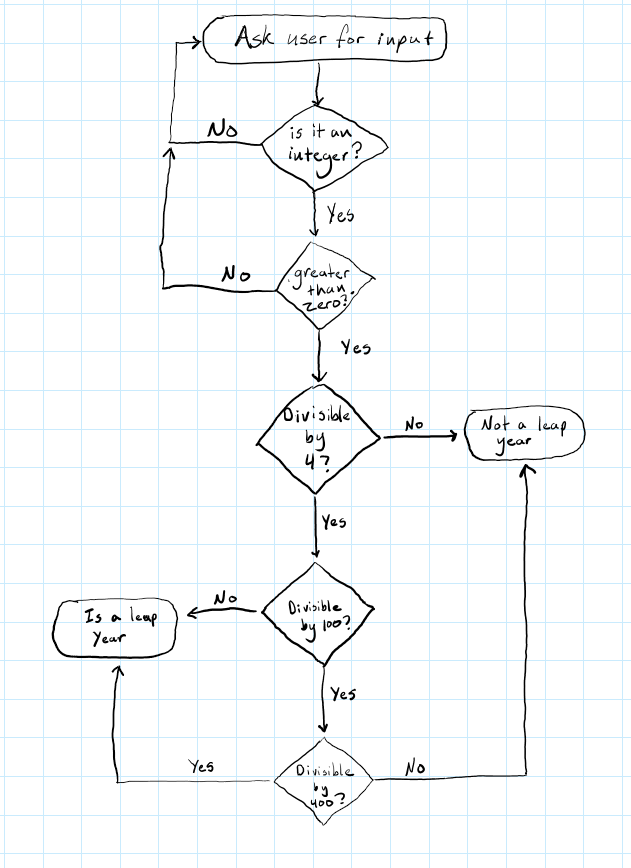

# Homework 3 - Leap year program

Python code for leap year programs.  Contains code from Homework 1 'leap_year_v1.py' and the new
updated program 'leap_year_v2.py' with the new requirement of input validation.  This code was
tested and run on OSUs flip server.

## Running code
Use the following command on flip server

```
$ python leap_year_v2.py
```

## Flowchart



